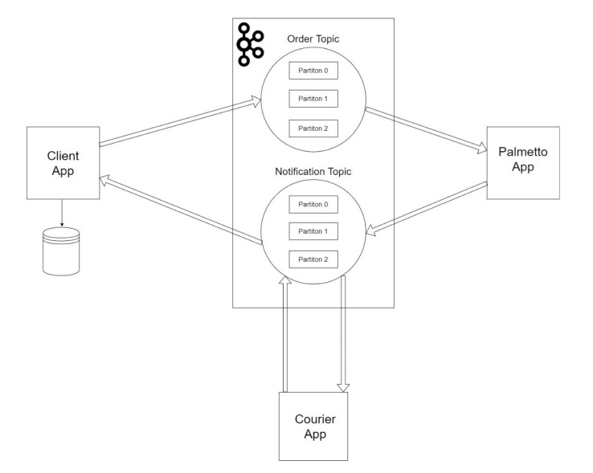
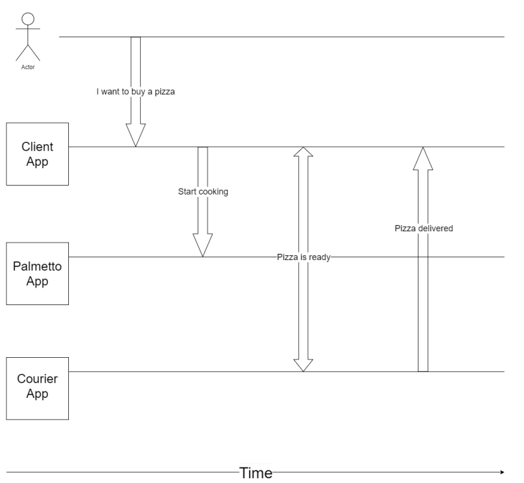
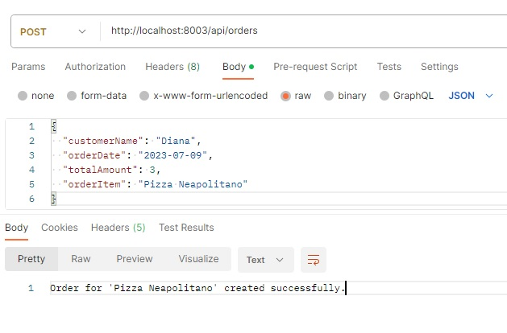
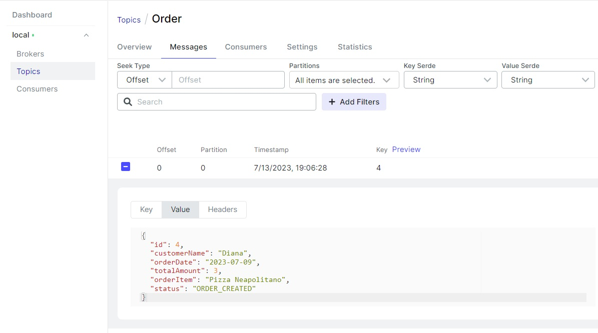
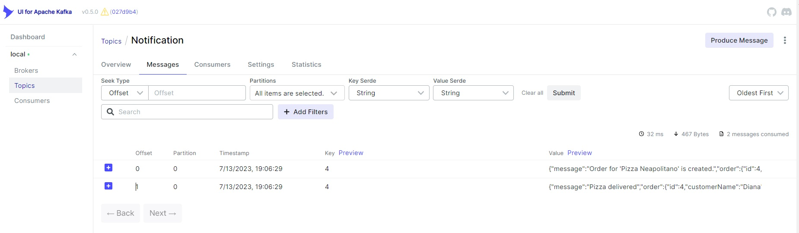
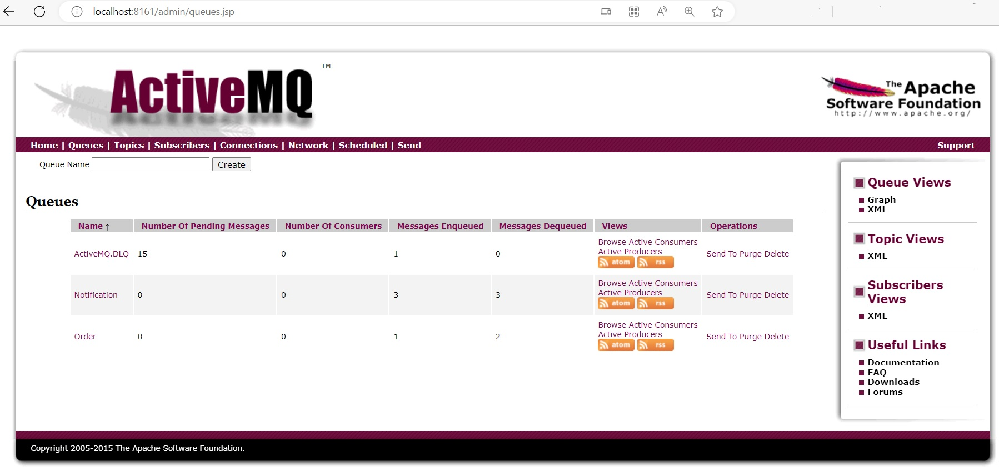
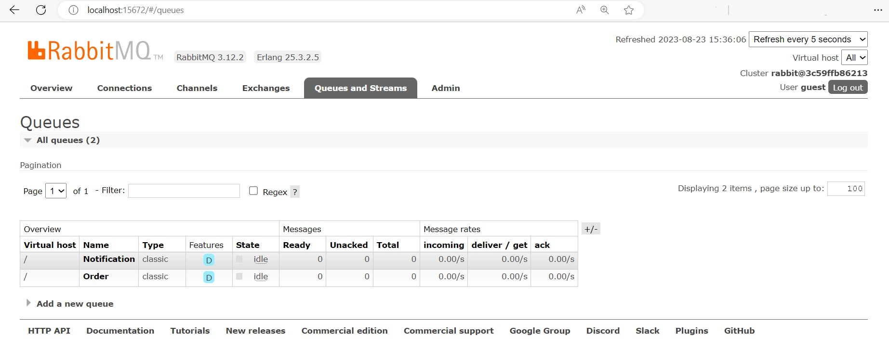

### Module "Kafka" of Java Global Mentoring Program

### Module "Messaging in Java: RabbitMQ, ActiveMQ" of Java Global Mentoring Program

This is Pizza Ordering System application, which showcases a microservices architecture with three messages brokers: Apache Kafka, ActiveMQ, RabbitMQ. The system allows customers to place pizza orders online, and the orders are processed by the "Palmetto" pizzeria service. The system consists of three Spring Boot applications: "Client App," "Palmetto App," and "Courier App."

### Application Modules

Application consists of the following modules:

1. **client**: This module represents the "Client App" and is responsible for receiving and storing incoming orders from customers. It provides a REST API with two endpoints: one for receiving orders and another for retrieving order information. 
2. **palmetto**: This module represents the "Palmetto App," which is the pizzeria service responsible for processing customer orders. It is subscribed to the "Order" topic in Apache Kafka for receiving orders from the "Client App." It also sends new order status messages to the "Notification" topic. 
3. **courier**: This module represents the "Courier App," which is the courier service responsible for delivering orders to customers. It is subscribed to the "Notification" topic for receiving order status messages from the "Palmetto App." It also sends new order status messages to the "Notification" topic. 
4. **model-common**: This module contains common model classes used by other modules, such as Notification, Order, and OrderStatus.

### System Architecture
The Pizza Ordering System follows a microservices architecture with Apache Kafka as the message broker. Kafka provides two topics: "Order" and "Notification."

The "Order" topic is used for sending events with customer orders from the "Client App" to the pizzeria. The "Palmetto App" consumes messages from this topic to process the orders.
The "Notification" topic is used for sending events with new order status messages. The "Client App" subscribes to this topic to receive order status updates. The "Palmetto App" sends order status messages to this topic, and the "Courier App" consumes messages from this topic to facilitate order delivery.

Please see the process diagram of the Pizza Ordering System app:

### Running the Application
To run the application, follow these steps:

1. Make sure you have Docker installed on your machine.
2. Clone the repository to your local environment.
3. Open a terminal and navigate to the project's root directory.
4. Run the command `docker-compose up` to start the required Docker containers for ZooKeeper, Kafka and Kafka UI.
5. Once the containers are up and running, you can start each Spring Boot application individually using your preferred IDE or by running `mvn spring-boot:run` in the module's directory.
6. Note: The Docker containers provided in the docker-compose.yml file include configurations for the required Kafka topics ("Order" and "Notification") and the communication between the services.

### Please see the below screenshots:

* #### POST request in Postman to create the order:

This screenshot shows a sample POST request made in Postman to create an order in the Pizza Ordering System app. The request is sent to the "Client App" API endpoint, which receives and processes the order.

* #### Order topic in Kafka UI with the message on created order:

This screenshot displays the "Order" topic in the Kafka UI. It shows a message related to a newly created order in the Pizza Ordering System app. The "Palmetto App" consumes messages from this topic to process the orders.

* #### Notification topic in Kafka UI with the messages on created order and delivered order:

This screenshot illustrates the "Notification" topic in the Kafka UI. It displays messages related to the status of orders in the Pizza Ordering System. One message indicates the creation of an order, and another message indicates the successful delivery of an order. The "Courier App" consumes messages from this topic to facilitate order delivery, and the "Client App" subscribes to this topic to receive updates on the order status.

### Accessing Management Consoles

#### ActiveMQ Console
You can access the ActiveMQ management console by opening your web browser and navigating to [http://localhost:8161/admin/queues.jsp](http://localhost:8161/admin/queues.jsp). This console allows you to manage queues and other ActiveMQ settings.

- **Username:** admin
- **Password:** admin

#### RabbitMQ Console
To access the RabbitMQ management console, open your web browser and go to [http://localhost:15672/#/queues](http://localhost:15672/#/queues). This console provides tools for managing queues and monitoring RabbitMQ.

- **Username:** guest
- **Password:** guest

### Conclusion
The Pizza Ordering System application demonstrates a microservices architecture with Apache Kafka, ActiveMQ, RabbitMQ as the message brokers. It allows customers to place orders online, and the orders are processed by the "Palmetto" pizzeria service. The system showcases the usage of Kafka topics for communication between services and demonstrates the benefits of a loosely coupled, scalable, and event-driven architecture.